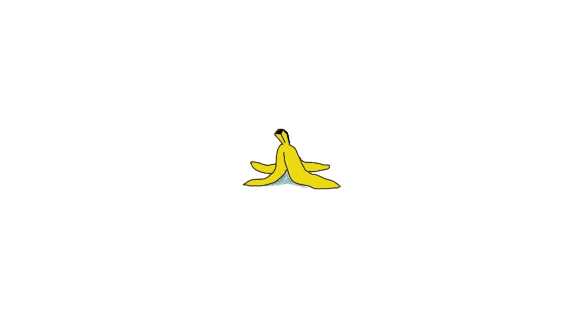
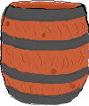

# Super BMX Bash
<div align="center">

[Let's play!](https://roomacarthur.github.io/deciders/)


</div>

A collaborative project for the Code Institute's August Hackathon, with a retro game theme.

## Introduction

*** 

Super BMX bash is a retro style game where the aim of the game is to cycle and hop your way around 5 laps of the track as quickly as possible.  
Avoid bananas and barrels, and stay on the track to maintain maximum speed.  
Pass through each checkpoint marker to get onto the next lap.
Don't forget to screenshot your best time to gain ultimate bragging rights for being the superior BMX basher.

  
Hop over or avoid banana peels. If you hit them you'll lose control of your bike momentarily.   
<br> 
  
If you hit these barrels your speed will be reduced to 0, so best if you don't.  
<br>
  
Do pass through these! They are checkpoints and you'll need to get them all to advance in laps.  
  
If you've got a need for speed then these pickups are for you! They'll give you a quick speed boost to help you zoom through the laps!

## Design and planning

***

### User Stories

- As a user I want to be entertained with a working retro game
- As a user I need to understand how to play the game
- As a user I want an element of competitiveness

### Game Operation

This section details the original plan for the game engine, but there are some differences between this and the final layout.

<details>
<summary>Click to reveal</summary>


</details>

- Game Manager:  
    Controls game start and end. Creates the other objects, runs the game loop. Here is the higher level game logic like win/lose condition, creating game and timing.
- Asset Manager:  
    Loads, stores and manages any resource files (sounds, level data, images). Game Objects would hold a reference to their resource, and give that to the audio/render manager for playing drawing.   
- Audio Manager:  
    Generates or plays sounds and audio files.  
- Render Manager:  
    Encapsulates drawing to the screen.  
- Camera:  
    Defines the player view in the game world. It will generate the information the Render Manager will use to do the actual drawing.  
- Map:  
    Stores information on the current level.  
- User Interaction Manager:  
    This is where the event listeners live. The event listeners don't perform any function themselves. They log the interaction and then the Update cycle will do the work of changing any states.   
- Game Object:  
    Base class for any entity in the game world. The player, items and scenery will derive from this, and any core functionality that all game objects need will be written here, collision detection for instance.  
- Player:  
    The users avatar. Represents the user in the game world.  
- Interactable:  
    Any non player object that can change the player state beyond collision; ie, speed boost.
- Pick ups:  
     Anything the player can pickup and changes their state.
- Scenery:  
    Anything that doesn't really do anything but can be collided with. Like a tree for instance.


## Technologies used

***

- CSS framework for web page design: https://nostalgic-css.github.io/NES.css/#  
    Only offers styling no alignment etc.
- Font Awesome for instruction icons


## File Structure

```
.
├── assets
    ├── css: All style files.
    ├── Js: All JS files.
        ├── modules
    ├── img: All images
        ├── objects
        ├── sprites
        ├── team
        ├── tracks
├── readme: Assets for README.md
├── index.html
├── game.html
├── about.html
├── README.md
```